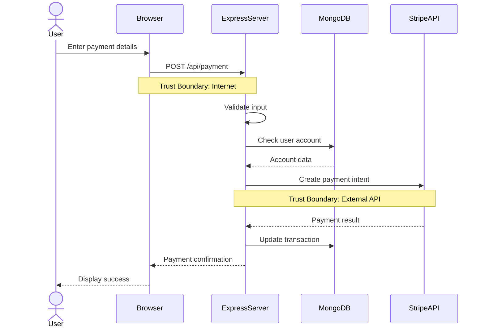

# Lesson 4: Security Code Review, Threat Modeling, and Auditing

## Demo Runbook (15-20 minutes)

**Target Audience:** Professional developers performing security code reviews and threat analysis

**Demo Application:** NodeGoat (Node.js/Express vulnerable app with complex business logic)

**Tools Required:**

- VS Code with GitHub Copilot Enterprise
- GitHub Enterprise Cloud with Advanced Security
- Node.js 18+ and npm
- GitHub Copilot Chat with knowledge bases (2025 feature)

---

## Prerequisites (Complete before demo - 5 minutes)

### 1. Setup NodeGoat with Code Review Branch

```bash
git clone https://github.com/OWASP/NodeGoat.git
cd NodeGoat
git checkout -b security-review
npm install
```

### 2. Configure Copilot Enterprise Knowledge Bases

In GitHub.com repository settings:

1. Navigate to Copilot → Knowledge Bases
2. Create knowledge base named "Security Standards"
3. Add documentation:
   - OWASP Top 10 2021
   - CWE Top 25
   - Your organization's security policies

### 3. Enable GitHub Advanced Security Alerts

Ensure GHAS is enabled for CodeQL, secret scanning, and Dependabot.

---

## Demo Part 1: Interactive Code Review with Copilot Chat (6 minutes)

### Scenario

Conduct a comprehensive security code review of NodeGoat's authentication and session management.

### Step 1: Architectural Context Setting

Open Copilot Chat (Ctrl/Cmd+Shift+I) and provide architecture context:

**Copilot Prompt:**

```text
I'm reviewing a Node.js/Express application with the following architecture:
- Frontend: EJS templates with client-side JavaScript
- Backend: Express.js with MongoDB
- Authentication: Passport.js with local strategy
- Session Management: express-session with MongoDB store
- Payment Processing: Stripe integration
- File Uploads: multer middleware

Threat Model Context:
- Internet-facing application
- Handles PII (names, addresses, SSNs)
- Processes credit card payments
- Multi-tenant SaaS architecture

Based on this context, I'll be asking security review questions about specific files.
Acknowledge this architecture context and summarize the top 5 security concerns.
```

**Expected Outcome:**

Copilot acknowledges context and identifies:

1. Session fixation and hijacking risks
2. Payment data handling and PCI-DSS compliance
3. MongoDB injection opportunities
4. Insecure Direct Object References in multi-tenant model
5. File upload validation and storage risks

### Step 2: Authentication Deep Dive

Open `app/routes/session.js` and ask Copilot:

**Copilot Prompt:**

```text
@workspace #file:session.js

Perform a comprehensive security audit of this authentication code.
Analyze for:

1. Password Storage: bcrypt usage, salt rounds, comparison timing attacks
2. Session Management: fixation, hijacking, secure cookie flags
3. Brute Force Protection: rate limiting, account lockout
4. Credential Validation: input sanitization, parameter pollution
5. Error Handling: information disclosure in auth failures

For each finding, provide:
- Exact line number
- Vulnerability description
- OWASP classification
- CWE reference
- Proof of concept exploit
- Remediation code snippet
```

**Expected Outcome:**

Copilot identifies multiple vulnerabilities:

```text
SECURITY FINDINGS - session.js

[CRITICAL] Missing Password Hashing (Line 42)
━━━━━━━━━━━━━━━━━━━━━━━━━━━━━━━━━━━━━━━━━━━━
Vulnerability: Passwords stored in plaintext
OWASP: A02:2021 - Cryptographic Failures
CWE: CWE-256 (Plaintext Storage of Password)

Current Code:
  user.password = req.body.password;

Exploit: Direct database access exposes all passwords

Remediation:
  const bcrypt = require('bcrypt');
  const saltRounds = 12;
  user.password = await bcrypt.hash(req.body.password, saltRounds);

[HIGH] Session Fixation Vulnerability (Line 67)
━━━━━━━━━━━━━━━━━━━━━━━━━━━━━━━━━━━━━━━━━━━━
Vulnerability: Session ID not regenerated after authentication
OWASP: A07:2021 - Identification and Authentication Failures
CWE: CWE-384 (Session Fixation)

Current Code:
  req.session.userId = user._id;

Exploit:
  1. Attacker obtains session ID before victim logs in
  2. Victim authenticates using attacker's session
  3. Attacker gains authenticated access

Remediation:
  req.session.regenerate((err) => {
    if (err) return next(err);
    req.session.userId = user._id;
    req.session.save(next);
  });

[HIGH] Missing Secure Cookie Flags (Line 12)
━━━━━━━━━━━━━━━━━━━━━━━━━━━━━━━━━━━━━━━━━━━━
Vulnerability: Session cookie vulnerable to XSS and MITM
OWASP: A05:2021 - Security Misconfiguration
CWE: CWE-614 (Sensitive Cookie in HTTPS Session Without 'Secure' Attribute)

Current Code:
  app.use(session({
    secret: 'mySecret',
    resave: false,
    saveUninitialized: true
  }));

Remediation:
  app.use(session({
    secret: process.env.SESSION_SECRET,
    resave: false,
    saveUninitialized: false,
    cookie: {
      secure: true,         // HTTPS only
      httpOnly: true,       // Prevent XSS access
      sameSite: 'strict',   // CSRF protection
      maxAge: 1800000       // 30 minute timeout
    }
  }));
```

### Step 3: Conversational Follow-Up Analysis

Continue the conversation with Copilot:

**Copilot Prompt:**

```text
For the session fixation vulnerability you found, show me:
1. A complete proof-of-concept exploit script
2. How this could be combined with XSS for maximum impact
3. Detection methods (what logs would show the attack)
4. Defensive code that prevents this entire class of vulnerability

Use the architecture context I provided earlier about this being a multi-tenant SaaS app.
```

**Expected Outcome:**

Copilot provides detailed exploit scenario specific to the multi-tenant context, showing how an attacker could hijack sessions across tenant boundaries.

---

## Demo Part 2: STRIDE Threat Modeling with Copilot (6 minutes)

### Scenario

Generate a comprehensive STRIDE threat model for NodeGoat's payment processing flow.

### Step 1: Generate Payment Flow Diagram

**Copilot Prompt:**

```text
@workspace

Analyze the payment processing workflow in this application by examining:
- app/routes/payment.js
- app/models/allocation.js
- Any Stripe API integrations

Generate a Mermaid sequence diagram showing:
1. User initiates payment
2. Payment validation
3. Stripe API interaction
4. Database updates
5. Confirmation flow

Include all trust boundaries (client, server, external API, database).
```

**Expected Outcome:**

Copilot generates Mermaid diagram:



### Step 2: Generate STRIDE Analysis

**Copilot Prompt:**

```text
Using the payment flow diagram you created, perform a comprehensive STRIDE threat model:

S - Spoofing: How could an attacker impersonate users or external services?
T - Tampering: What data could be modified in transit or at rest?
R - Repudiation: What actions lack audit trails?
I - Information Disclosure: What sensitive data could leak?
D - Denial of Service: What could make the system unavailable?
E - Elevation of Privilege: How could users gain unauthorized access?

For each threat category:
1. List specific threats (minimum 3 per category)
2. Rate likelihood (High/Medium/Low) and impact (High/Medium/Low)
3. Identify affected components
4. Propose mitigations with implementation priority
5. Map to OWASP Top 10 and CWE

Format as a comprehensive markdown table.
```

**Expected Outcome:**

Detailed STRIDE analysis:

```markdown
## STRIDE Threat Model: Payment Processing Flow

### Spoofing Threats

| Threat | Likelihood | Impact | Component | Mitigation | OWASP | CWE |
|--------|------------|--------|-----------|------------|-------|-----|
| Attacker uses stolen session token to impersonate user | High | High | Express Session | Implement mutual TLS, bind sessions to IP, use device fingerprinting | A07 | CWE-290 |
| Fake Stripe webhook pretends to be payment confirmation | Medium | Critical | Webhook endpoint | Verify webhook signatures using Stripe's signature validation | A02 | CWE-345 |
| User submits payment on behalf of different tenant | High | Critical | Multi-tenancy | Enforce tenant validation at middleware level, not controller | A01 | CWE-639 |

### Tampering Threats

| Threat | Likelihood | Impact | Component | Mitigation | OWASP | CWE |
|--------|------------|--------|-----------|------------|-------|-----|
| Modify payment amount in transit | Low | High | HTTP requests | Enforce HTTPS, implement HMAC signing of payment requests | A02 | CWE-353 |
| Alter transaction records in MongoDB | Medium | High | Database | Enable MongoDB authentication, use encrypted storage | A04 | CWE-306 |
| Replay old payment confirmation | High | Medium | State management | Implement nonce/jti for one-time use tokens | A04 | CWE-294 |

### Repudiation Threats

| Threat | Likelihood | Impact | Component | Mitigation | OWASP | CWE |
|--------|------------|--------|-----------|------------|-------|-----|
| User denies making payment | High | High | Audit logging | Implement comprehensive logging with digital signatures | A09 | CWE-778 |
| Admin denies refund action | Medium | Medium | Admin actions | Add audit trail with non-repudiation (signed logs to SIEM) | A09 | CWE-778 |

### Information Disclosure Threats

| Threat | Likelihood | Impact | Component | Mitigation | OWASP | CWE |
|--------|------------|--------|-----------|------------|-------|-----|
| Credit card numbers exposed in logs | High | Critical | Logging | Implement PCI-DSS compliant log sanitization | A02 | CWE-532 |
| MongoDB query errors reveal database structure | High | Medium | Error handling | Generic error messages to users, detailed logs to SIEM only | A05 | CWE-209 |
| Stripe API keys in source code | Critical | Critical | Configuration | Use environment variables, enable secret scanning | A05 | CWE-798 |

### Denial of Service Threats

| Threat | Likelihood | Impact | Component | Mitigation | OWASP | CWE |
|--------|------------|--------|-----------|------------|-------|-----|
| Payment endpoint flooded with requests | High | High | API endpoint | Rate limiting (10 req/min per user), CAPTCHA for suspicious patterns | A05 | CWE-770 |
| Large payment payload crashes server | Medium | High | Input validation | Implement request size limits (100KB max) | A04 | CWE-400 |

### Elevation of Privilege Threats

| Threat | Likelihood | Impact | Component | Mitigation | OWASP | CWE |
|--------|------------|--------|-----------|------------|-------|-----|
| Regular user processes refund (admin action) | High | Critical | Authorization | Implement RBAC with claim-based authorization | A01 | CWE-269 |
| SQL/NoSQL injection leads to admin account creation | High | Critical | Database queries | Use parameterized queries, input validation, prepared statements | A03 | CWE-89 |
```

### Step 3: Generate Mitigation Implementation Plan

**Copilot Prompt:**

```text
Based on the STRIDE analysis, generate a prioritized implementation plan:

1. Group mitigations by implementation effort (Quick wins, Medium effort, Large projects)
2. Create GitHub Issues for each mitigation with:
   - Detailed description
   - Acceptance criteria
   - Implementation guidance
   - Security test requirements
3. Generate code snippets for top 3 highest priority mitigations
4. Create a security roadmap (timeline for implementation)

Export as markdown suitable for pasting into GitHub Project.
```

---

## Demo Part 3: Automated Compliance Reporting (5 minutes)

### Scenario

Generate comprehensive security compliance reports from GHAS data.

### Step 1: Query GHAS API for Findings

**Copilot Prompt:**

```text
Create a Node.js script that:

1. Uses GitHub GraphQL API to fetch:
   - All CodeQL code scanning alerts
   - Secret scanning findings
   - Dependabot vulnerability alerts
   - Pull request security checks history

2. Aggregates data by:
   - Severity (critical, high, medium, low)
   - OWASP Top 10 category
   - CWE classification
   - Component/file path
   - Age (time since first detected)

3. Generates three reports:
   a) Executive summary (1-page PDF)
   b) Technical detail (full OWASP mapping)
   c) Trend analysis (week-over-week improvements)

Use the @octokit/graphql library and export reports in Markdown and JSON.
Save as scripts/generate-compliance-report.js
```

**Expected Outcome:**

```javascript
const { graphql } = require('@octokit/graphql');
const fs = require('fs');

const graphqlWithAuth = graphql.defaults({
  headers: {
    authorization: `token ${process.env.GITHUB_TOKEN}`,
  },
});

async function fetchSecurityAlerts(owner, repo) {
  const query = `
    query($owner: String!, $repo: String!) {
      repository(owner: $owner, name: $repo) {
        vulnerabilityAlerts(first: 100) {
          nodes {
            createdAt
            dismissedAt
            securityVulnerability {
              package { name }
              severity
              advisory {
                description
                cvss { score }
                cwes(first: 10) {
                  nodes { cweId }
                }
              }
            }
          }
        }
        codeScanning Alerts(first: 100) {
          nodes {
            createdAt
            state
            rule {
              id
              severity
              securitySeverityLevel
              description
              tags
            }
            mostRecentInstance {
              location {
                path
                startLine
              }
            }
          }
        }
      }
    }
  `;

  const result = await graphqlWithAuth(query, { owner, repo });
  return result.repository;
}

function mapToOWASP(tags, cwes) {
  const owaspMapping = {
    'injection': 'A03:2021 - Injection',
    'xss': 'A03:2021 - Injection',
    'auth': 'A07:2021 - Identification and Authentication Failures',
    'crypto': 'A02:2021 - Cryptographic Failures',
    // ... more mappings
  };

  // Map based on tags and CWEs
  // Return OWASP category
}

function generateExecutiveSummary(data) {
  const summary = `
# Security Compliance Report - ${new Date().toISOString().split('T')[0]}

## Executive Summary

**Overall Security Posture:** ${calculatePosture(data)}

**Key Metrics:**
- Total Vulnerabilities: ${data.totalVulnerabilities}
- Critical: ${data.critical} | High: ${data.high} | Medium: ${data.medium} | Low: ${data.low}
- Mean Time to Remediate (MTTR): ${data.mttr} days
- Vulnerabilities Fixed This Week: ${data.fixedThisWeek}
- New Vulnerabilities Introduced: ${data.newThisWeek}

**OWASP Top 10 Coverage:**
${generateOWASPTable(data)}

**Trend:** ${data.trend === 'improving' ? '✅ Security posture improving' : '⚠️ Action required'}

**Compliance Status:**
- PCI-DSS: ${data.pciCompliance}
- SOC 2: ${data.soc2Compliance}
- GDPR: ${data.gdprCompliance}

## Top Priorities
${generateTopPriorities(data)}
  `;

  return summary;
}
```

### Step 2: Automate Report Generation in GitHub Actions

**Copilot Prompt:**

```text
Create a GitHub Actions workflow that:

1. Runs weekly (Monday 9 AM) and on-demand via workflow_dispatch
2. Executes the compliance report script
3. Generates reports in multiple formats (Markdown, HTML, PDF)
4. Commits reports to docs/security-reports/ with timestamp
5. Creates GitHub Wiki page with latest report
6. Posts summary to Slack channel #security
7. Opens GitHub Issue if critical vulnerabilities exceed threshold

Save as .github/workflows/weekly-security-report.yml
```

---

## Demo Part 4: AI-Powered Dependency Analysis (3 minutes)

### Scenario

Intelligently triage Dependabot alerts using Copilot's reasoning capabilities.

### Step 1: Analyze CVE Exploitability

Open a Dependabot alert in GitHub and use Copilot Chat on GitHub.com (2025 feature):

**Copilot Prompt:**

```text
@github Analyze Dependabot alert #42 (lodash prototype pollution CVE-2024-XXXXX):

Context about our application:
- We use lodash only for server-side data transformation
- Input data comes from authenticated admin users only
- Data is validated before lodash processing
- Application runs in isolated Kubernetes pods

Questions:
1. Is this CVE exploitable given our specific usage pattern?
2. What would an attacker need to compromise to exploit this?
3. Are there compensating controls that mitigate the risk?
4. What's the recommended priority (Critical/High/Medium/Low)?
5. Generate an upgrade plan considering breaking changes in latest lodash version
```

**Expected Outcome:**

Copilot provides contextualized analysis:

```text
CVE-2024-XXXXX Exploitability Assessment

VERDICT: Low Priority - Not Exploitable in Current Context

ANALYSIS:
1. Exploitability: LOW
   - CVE requires attacker-controlled input to lodash.merge()
   - Your usage (data transformation) uses trusted admin input only
   - Authentication requirement significantly raises attack bar

2. Attack Prerequisites:
   - Compromise admin account (already high-value target)
   - Identify specific lodash.merge() call accepting user input
   - Craft prototype pollution payload
   - Chain with another vulnerability for impact

3. Compensating Controls:
   ✅ Authentication required (admin-only)
   ✅ Input validation before lodash processing
   ✅ Pod isolation limits lateral movement
   ✅ No eval() or similar dangerous sinks detected

4. Recommended Priority: MEDIUM
   While not immediately exploitable, defense-in-depth suggests upgrading.
   This prevents future risk if usage patterns change.

5. Upgrade Plan:
   Current: lodash@4.17.19
   Target: lodash@4.17.21 (patches CVE, no breaking changes)

   Breaking changes: NONE for 4.17.19 → 4.17.21

   Implementation:
   - Update package.json: "lodash": "^4.17.21"
   - Run: npm update lodash
   - Test: npm test (all existing tests should pass)
   - Deploy: Low risk, can bundle with next release

RECOMMENDATION: Schedule upgrade in next sprint (non-urgent).
Monitor for lodash usage expansion to untrusted input sources.
```

### Step 2: Auto-Generate Dependency Upgrade PR

**Copilot Prompt:**

```text
Based on your exploitability analysis, generate a pull request that:

1. Updates lodash to recommended version
2. Includes detailed PR description explaining:
   - CVE details and exploitability assessment
   - Why upgrade is recommended despite low risk
   - Testing performed
   - Rollback plan if issues occur
3. Adds automated tests validating prototype pollution is prevented
4. Updates security documentation

Use GitHub CLI to create the PR.
```

---

## Validation & Key Takeaways (1 minute)

### What We Demonstrated

1. **Interactive Code Review**: Used Copilot Chat for conversational security analysis with architectural context
2. **STRIDE Threat Modeling**: Generated comprehensive threat models in minutes instead of days
3. **Automated Compliance**: Created reports mapping GHAS findings to OWASP, CWE, and compliance frameworks
4. **Intelligent Triage**: Applied AI reasoning to dependency alerts for contextualized risk assessment
5. **GitHub.com Integration**: Leveraged Copilot directly in GitHub.com for alert analysis (2025 feature)

### Advanced Prompting Techniques

1. **Context Setting**: Provide architecture and threat model upfront
2. **Conversational Refinement**: Ask follow-up questions to drill deeper
3. **Explicit Output Format**: Request Mermaid diagrams, markdown tables, specific report formats
4. **Knowledge Base References**: Use `@github` to query GHAS alerts directly
5. **Chain of Thought**: Build complex analyses through multi-step prompts

### Key Benefits Realized

- **10x faster code reviews**: Comprehensive analysis in minutes vs. hours
- **Consistent threat modeling**: STRIDE analysis without requiring specialized expertise
- **Reduced alert fatigue**: Intelligent CVE triage focuses effort on real risks
- **Automated documentation**: Compliance reports generated from code, always current

---

## Next Steps

1. Perform STRIDE threat modeling on your critical flows
2. Enable Copilot Chat integration with GHAS alerts
3. Automate weekly security compliance reports
4. Build CVE exploitability decision tree
5. Move to Lesson 5: Compliance & Configuration Management

---

## Troubleshooting

**Issue**: Copilot providing generic security advice

- **Solution**: Provide detailed architectural context in initial prompt
- Include technology stack, data sensitivity, deployment model
- Reference specific files with `@workspace #file:path`

**Issue**: STRIDE analysis missing threats

- **Solution**: Ask Copilot to review coverage: "Did you miss any common threats for payment flows?"
- Provide examples of threats from past incidents
- Iterate with "What about [specific threat category]?"

**Issue**: GitHub API rate limiting in report script

- **Solution**: Implement pagination and caching
- Use GraphQL instead of REST API (more efficient)
- Run less frequently or use GitHub App authentication (higher limits)

---

## Additional Resources

- STRIDE Threat Modeling: <https://learn.microsoft.com/en-us/azure/security/develop/threat-modeling-tool>
- OWASP Top 10: <https://owasp.org/Top10/>
- CWE Top 25: <https://cwe.mitre.org/top25/>
- GitHub Advanced Security API: <https://docs.github.com/en/rest/security-advisories>
- Copilot Chat Documentation: <https://docs.github.com/en/copilot/github-copilot-chat>
